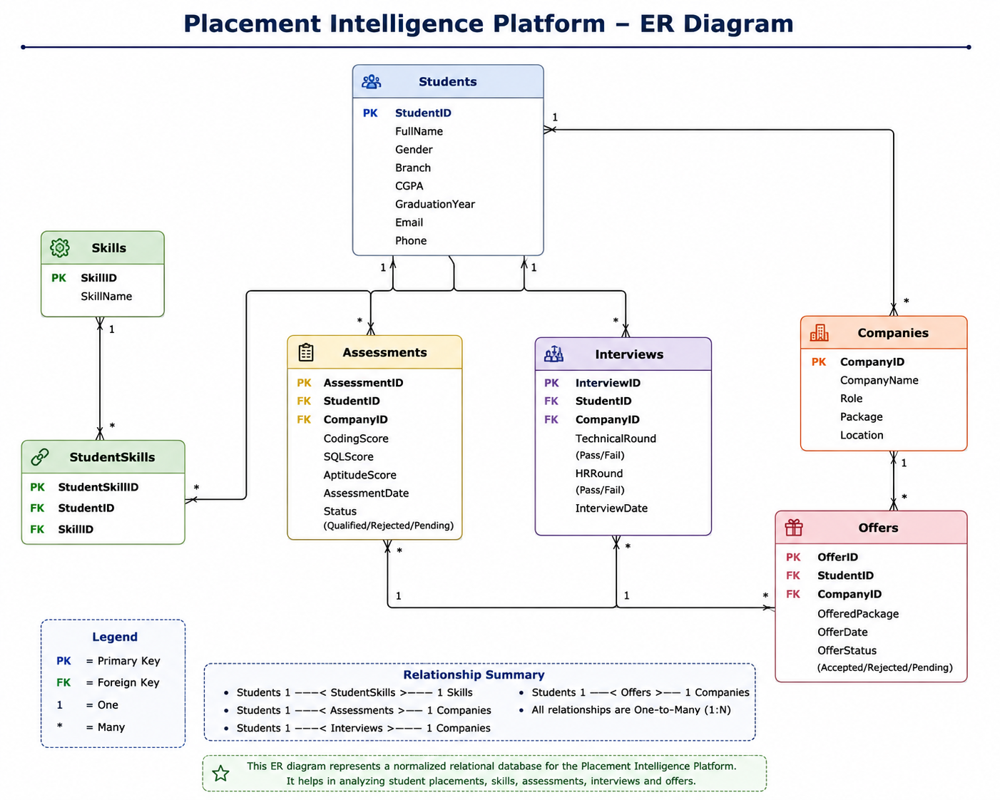

# Placement Intelligence Platform

A SQL-based database project designed to manage and analyze student placement data. The project demonstrates database design, normalization, SQL querying, and data generation using Python.

---

## Project Overview

The Placement Intelligence Platform is a relational database project that stores and analyzes information related to student placements. It helps placement officers and recruiters track student performance, technical skills, assessment scores, interview results, and placement offers.

The project follows normalization principles and uses SQL queries to generate meaningful insights from placement data.

---

## Problem Statement

Managing placement data manually becomes difficult as the number of students and recruiting companies increases.

This project provides a centralized database to:

- Store student information
- Manage company recruitment details
- Track technical skills
- Record assessment scores
- Store interview results
- Maintain placement offers
- Generate placement analytics using SQL

---

## Database Schema

The project consists of **7 normalized tables**.

| Table | Description |
|--------|-------------|
| Students | Student details |
| Companies | Company recruitment details |
| Skills | Technical skills |
| StudentSkills | Mapping between students and skills |
| Assessments | Coding, SQL and aptitude assessment scores |
| Interviews | Interview round results |
| Offers | Placement offers |

---

## Entity Relationship Diagram

> Add your ER Diagram image inside the **images** folder.

```text
images/
└── er_diagram.png
```

Then display it using:

```markdown

```

---

## Features

- Student Management
- Company Management
- Skill Tracking
- Assessment Management
- Interview Tracking
- Offer Management
- Placement Analytics
- SQL Reporting

---

## Technologies Used

- MySQL Workbench
- SQL
- Python
- Pandas
- Google Colab
- CSV Files
- Git
- GitHub

---

## SQL Concepts Used

This project demonstrates practical use of:

- CREATE DATABASE
- CREATE TABLE
- Primary Keys
- Foreign Keys
- Constraints
- INNER JOIN
- Aggregate Functions
- GROUP BY
- HAVING
- ORDER BY
- LIMIT
- Subqueries
- Filtering using WHERE

---

## Sample SQL Queries

### Display all students

```sql
SELECT * FROM Students;
```

### Find students with CGPA above 8

```sql
SELECT FullName, CGPA
FROM Students
WHERE CGPA > 8;
```

### Company-wise hiring count

```sql
SELECT
    c.CompanyName,
    COUNT(o.StudentID) AS StudentsHired
FROM Companies c
JOIN Offers o
ON c.CompanyID = o.CompanyID
GROUP BY c.CompanyName;
```

### Top 10 Coding Scores

```sql
SELECT
    s.FullName,
    a.CodingScore
FROM Assessments a
JOIN Students s
ON a.StudentID = s.StudentID
ORDER BY a.CodingScore DESC
LIMIT 10;
```

---

## Project Structure

```text
Placement-Intelligence-Platform/
│
├── README.md
│
├── data/
│   ├── students.csv
│   ├── companies.csv
│   ├── skills.csv
│   ├── studentskills.csv
│   ├── assessments.csv
│   ├── interviews.csv
│   └── offers.csv
│
├── sql/
│   ├── schema.sql
│   └── queries.sql
│
├── notebook/
│   └── Data_Generation.ipynb
│
├── images/
│   └── er_diagram.png
│
└── docs/
```

---

## Future Enhancements

- Interactive Dashboard using Power BI
- Placement Prediction using Machine Learning
- Web Application using Flask
- Student Login Portal
- Recruiter Dashboard
- Resume Analysis
- Placement Recommendation System

---

## Author

**Purma Srija**

B.Tech – Computer Science Engineering

### Skills

- SQL
- MySQL
- Python
- Data Analytics
- Database Design

---

## Project Highlights

- Designed a normalized relational database with 7 interconnected tables.
- Generated synthetic placement data using Python and Pandas.
- Imported and managed data in MySQL Workbench.
- Wrote 30+ SQL queries for analytics and reporting.
- Demonstrated Joins, Aggregations, Subqueries, Filtering, and Grouping.